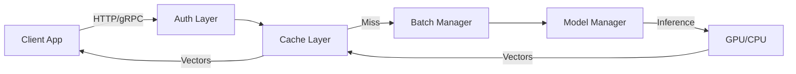

# Embedding Server


A high-performance, self-hosted, model-agnostic embedding service designed for LLM applications, RAG pipelines, and code intelligence tools. It serves as a drop-in replacement for OpenAI's embedding API while offering advanced features like native batching, smart chunking, and hardware acceleration.

## Key Features

*   🚀 **High Performance**: Native batch processing and async architecture for maximum throughput.
*   🧠 **Multi-Model Support**: Run any Hugging Face model (e.g., MiniLM, BGE, E5) with dynamic loading.
*   🤝 **OpenAI Compatible**: Seamlessly works with LangChain, LlamaIndex, and AutoGPT using standard OpenAI clients.
*   🔪 **Smart Chunking**: Built-in text splitting (Token/Character) with overlap handling to fit model context windows.
*   ⚡ **Caching**: Integrated Redis & In-Memory caching to eliminate redundant computations.
*   🛡️ **Production Ready**: API Key/JWT authentication, rate limiting, and Prometheus metrics.
*   ⚙️ **Hardware Acceleration**: Auto-detects NVIDIA CUDA or Apple MPS (Metal) for GPU inference.
*   🔌 **Dual Protocol**: Exposes both HTTP (FastAPI) and gRPC interfaces.

## Architecture



## Installation

### Prerequisites
*   **Python 3.11** (Recommended)
*   Docker & Docker Compose (Optional)

### Local Setup

1.  **Clone the repository:**
    ```bash
    git clone https://github.com/abdullah85398/embedding-server.git
    cd embedding-server
    ```

2.  **Install dependencies:**
    ```bash
    pip install -r requirements.txt
    ```

3.  **Configure environment:**
    Copy the example environment file:
    ```bash
    cp .env.example .env
    ```
    *Edit `.env` to set your API Key or enable Redis if needed.*

### Docker Setup

Run the server with a single command:
```bash
docker-compose up --build -d
```
The server will be available at `http://localhost:8000`.

## Usage Guide

### Running the Server

Start the server locally:
```bash
python main.py
```
*   **HTTP API**: `http://localhost:8000`
*   **gRPC API**: `localhost:50051`
*   **Swagger UI**: `http://localhost:8000/docs`

### Configuration

#### Environment Variables (`.env`)

| Variable | Default | Description |
| :--- | :--- | :--- |
| `AUTH_MODE` | `KEY` | Auth mode: `NONE`, `KEY`, or `JWT`. |
| `API_KEY` | `changeme` | Master API Key for requests. |
| `JWT_SECRET` | `secret` | Secret for JWT signing (if mode is JWT). |
| `ENABLE_CACHE` | `True` | Enable result caching. |
| `REDIS_URL` | - | Redis connection string (uses memory if empty). |
| `MAX_INFLIGHT_REQUESTS` | `100` | Concurrency limit (semaphore). |

#### Model Configuration (`models.yaml`)

Define available models in `models.yaml`. The key is the alias used in API calls.

```yaml
models:
  mini:
    name: all-MiniLM-L6-v2
    preload: true
  bge:
    name: BAAI/bge-base-en-v1.5
    preload: true
```

### API Examples

#### 1. Standard Embedding
Generate a vector for a text string.

```bash
curl -X POST http://localhost:8000/embed \
  -H "X-API-Key: changeme" \
  -H "Content-Type: application/json" \
  -d '{
    "model": "mini",
    "input": "Hello world"
  }'
```

#### 2. Native Batching
Process multiple texts in parallel (optimized for GPU).

```bash
curl -X POST http://localhost:8000/embed \
  -H "X-API-Key: changeme" \
  -H "Content-Type: application/json" \
  -d '{
    "model": "mini",
    "input": ["Document 1", "Document 2", "Document 3"]
  }'
```

#### 3. Smart Chunking
Split long text into chunks (e.g., 256 tokens) and embed each.

```bash
curl -X POST http://localhost:8000/embed/chunk \
  -H "X-API-Key: changeme" \
  -H "Content-Type: application/json" \
  -d '{
    "model": "mini",
    "input": "Very long text content...",
    "method": "token",
    "size": 256,
    "overlap": 20
  }'
```

#### 4. OpenAI Compatibility
Works with standard OpenAI libraries.

```python
from openai import OpenAI

client = OpenAI(
    base_url="http://localhost:8000/v1",
    api_key="changeme"
)

response = client.embeddings.create(
    model="mini",
    input="Hello from OpenAI client!"
)
print(response.data[0].embedding)
```

## Development

### Running Tests
The project uses `pytest` for testing. This includes unit tests and documentation integrity checks.

```bash
# Run all tests
pytest

# Verify documentation examples match implementation
pytest tests/test_docs_integrity.py
```

### Linting
We use `ruff` for code quality.

```bash
pip install ruff
ruff check .
```

### Contribution
1.  Fork the repository.
2.  Create a feature branch (`git checkout -b feature/amazing-feature`).
3.  Commit your changes (`git commit -m 'Add amazing feature'`).
4.  Run tests to ensure no regressions.
5.  Push to the branch (`git push origin feature/amazing-feature`).
6.  Open a Pull Request.

## License

This project is licensed under the MIT License.
